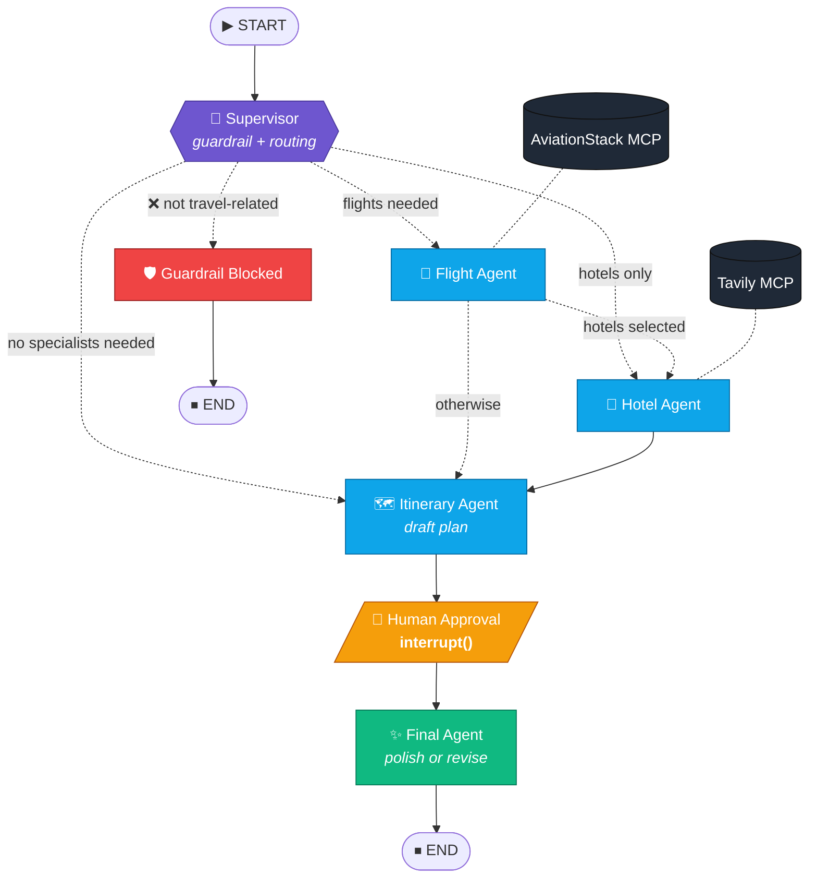
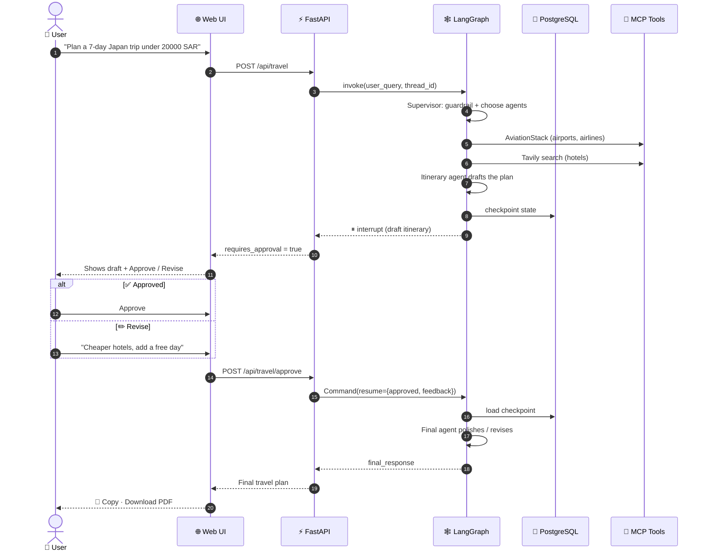
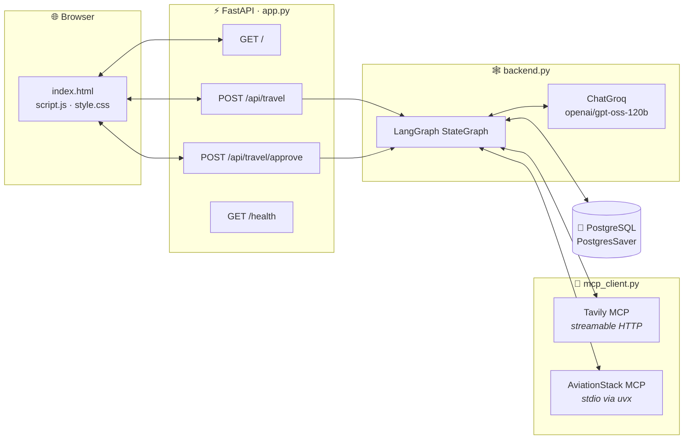

<div align="center">

# ✈️ TripMate AI

### A Multi-Agent Travel Planner built with LangGraph, MCP & FastAPI

*Describe your dream trip in plain English. A team of AI agents researches flights and hotels, drafts an itinerary, waits for **your approval**, and delivers a polished travel plan.*


</div>

---

## 📖 Table of Contents

- [Features](#-features)
- [Agent Graph](#-agent-graph)
- [How a Request Flows](#-how-a-request-flows)
- [The Agents](#-the-agents)
- [System Architecture](#-system-architecture)
- [Using the App](#-using-the-app)
- [API Reference](#-api-reference)
- [Getting Started](#-getting-started)
- [Project Structure](#-project-structure)
- [Tech Stack](#-tech-stack)

---

## 🌟 Features

| | Feature | What it does |
|---|---|---|
| 🧠 | **Supervisor agent** | Reads your request, extracts trip constraints (origin, destination, duration, budget, style) and picks only the specialist agents it needs |
| 🛡️ | **Input guardrail** | Blocks requests that aren't about travel, or that ask for harmful content, before any tool runs |
| 🛫 | **Flight agent** | Pulls real airport and airline data through the **AviationStack MCP server** |
| 🏨 | **Hotel agent** | Runs a live web search for accommodation through the **Tavily MCP server** |
| 🗺️ | **Itinerary agent** | Combines everything into a practical, budget-aware day-by-day draft |
| 🙋 | **Human-in-the-loop** | The graph **pauses** so you can approve the draft or ask for changes |
| 💾 | **Persistent memory** | Every run is checkpointed to **PostgreSQL**, so a paused plan can be resumed later using its `thread_id` |
| 📄 | **Export** | Copy the final plan or download it as a PDF |

---

## 🕸️ Agent Graph

This is the LangGraph `StateGraph` defined in [`backend.py`](backend.py). Solid arrows are fixed edges and dotted arrows are conditional routes.



**Routing rules**

- Specialist agents always run in a fixed order: `flight_agent` → `hotel_agent` → `itinerary_agent`. Any agent the supervisor didn't select is skipped.
- `itinerary_agent` **always** runs, because it combines whatever results the other agents produced.
- If the supervisor's JSON can't be parsed, the graph **falls back to the full workflow**. If the guardrail's JSON can't be parsed, the request is **allowed through**, so a formatting slip never breaks a real trip request.

---

## 🔄 How a Request Flows



---

## 🤖 The Agents

<details open>
<summary><b>🧠 Supervisor</b>: guardrail and planner</summary>

Makes two LLM calls:
1. **Guardrail**: returns `{"allowed": bool, "reason": str}`. Accepts destinations, flights, hotels, weather, budgets, visas, transport, food, packing and itineraries.
2. **Router**: returns `selected_agents`, the structured `trip_constraints` and its `reasoning`, all of which are shown in the UI's *Execution Plan* panel.
</details>

<details>
<summary><b>🛫 Flight Agent</b></summary>

Calls the `list_airports` and `list_airlines` tools on the AviationStack MCP server, then asks the LLM for the likely departure and arrival airports, the airlines on the route, typical flight time, an estimated fare range, peak-season warnings and booking advice.
</details>

<details>
<summary><b>🏨 Hotel Agent</b></summary>

Runs a live `tavily_search` for *"Best hotels for &lt;your request&gt;"*. If the search fails, it switches to general accommodation guidance and labels it as non-live advice.
</details>

<details>
<summary><b>🗺️ Itinerary Agent</b></summary>

Combines the user query, trip constraints, flight results and hotel results into a practical, budget-aware draft that's ready for review.
</details>

<details>
<summary><b>🙋 Human Approval</b></summary>

Calls LangGraph's `interrupt()`, which saves the state to Postgres and pauses the run. It resumes when `/api/travel/approve` is called with `{approved, feedback}`.
</details>

<details>
<summary><b>✨ Final Agent</b></summary>

Produces the finished plan with these sections: **Trip Summary · Flight Information · Hotel Suggestions · Day-by-Day Itinerary · Final Recommendations**. If you asked for a revision, it applies your feedback here.
</details>

---

## 🏗️ System Architecture



---

## 🖥️ Using the App

1. **Describe your trip.** Type a request or pick one of the quick prompts:
   > *Plan a complete 7 days Japan trip from Saudi Arabia including flights, hotels and sightseeing.*
2. **See the execution plan.** The UI shows whether the guardrail passed, the supervisor's reasoning, and a chip for each agent that was selected.
3. **Review the draft.** The draft itinerary appears together with an approval panel.
4. **Approve or revise.**
   - ✅ **Approve** to get a polished final plan.
   - ✏️ **Revise** with feedback such as *"reduce the hotel cost and add one free day"*. The final agent rewrites the plan to match.
5. **Export.** Copy the plan to your clipboard or download it as a PDF.

---

## 📡 API Reference

### `POST /api/travel`
Starts a new planning run. The run pauses at human approval.

```json
// Request
{ "message": "Plan a 5 day Dubai trip from Riyadh", "thread_id": null }
```

```json
// Response (abridged)
{
  "success": true,
  "thread_id": "user_3f9c...",
  "requires_approval": true,
  "answer": "## Draft itinerary ...",
  "selected_agents": ["flight_agent", "hotel_agent", "itinerary_agent"],
  "trip_constraints": { "destination": "Dubai", "origin": "Riyadh", "duration": "5 days", "...": "..." },
  "supervisor_reasoning": "...",
  "guardrail_allowed": true,
  "llm_calls": 5
}
```

### `POST /api/travel/approve`
Resumes a paused run. `feedback` is **required** when `approved` is `false`.

```json
{ "thread_id": "user_3f9c...", "approved": false, "feedback": "Make it cheaper" }
```

### `GET /health`
Returns the service status and a list of enabled features.

---

## 🚀 Getting Started

### Prerequisites
- Python **3.11+**
- A **PostgreSQL** database, local or hosted (for example Render or Neon)
- [`uv`](https://docs.astral.sh/uv/), which provides the `uvx` command used to launch the AviationStack MCP server
- API keys for: [Groq](https://console.groq.com) · [Tavily](https://tavily.com) · [AviationStack](https://aviationstack.com)

### 1. Clone and install

```bash
git clone https://github.com/MuteebMMN/TripeMate-MultiAgent.git
cd TripeMate-MultiAgent

python -m venv .venv
source .venv/bin/activate        # Windows: .venv\Scripts\activate
pip install -r requirements.txt
```

### 2. Configure environment variables

Copy the example file and fill in your keys:

```bash
cp .env.example .env
```

| Variable | Required | Description |
|---|:---:|---|
| `GROQ_API_KEY` | ✅ | LLM inference |
| `DATABASE_URL` | ✅ | PostgreSQL connection string. `sslmode=require` is added automatically |
| `TAVILY_API_KEY` | ✅ | Hotel web search |
| `AVIATIONSTACK_API_KEY` | ✅ | Airport and airline data |
| `DEFAULT_ORIGIN_IATA` | ➖ | Default departure airport code |
| `OPENWEATHER_API_KEY` | ➖ | Custom weather MCP server |
| `LANGSMITH_*` | ➖ | Optional LangSmith tracing |

### 3. Run

```bash
python app.py
```

Then open **http://127.0.0.1:8000** 🎉

### 🐳 Run with Docker

```bash
docker build -t tripmate-ai .
docker run -p 8000:8000 --env-file .env tripmate-ai
```

---

## 📁 Project Structure

```
TripeMate-MultiAgent/
├── app.py              # FastAPI server: routes, request models, HTML serving
├── backend.py          # LangGraph state, agents, routing, Postgres checkpointer
├── mcp_client.py       # MCP client setup (Tavily, AviationStack, Weather)
├── templates/
│   └── index.html      # Single-page UI
├── static/
│   ├── script.js       # API calls, approval flow, markdown rendering, PDF export
│   └── style.css       # Styling
├── requirements.txt
├── Dockerfile
└── .env.example
```

---

## 🧰 Tech Stack

| Layer | Technology |
|---|---|
| Orchestration | **LangGraph** `StateGraph`, `interrupt()`, `Command(resume=…)` |
| LLM | **Groq**: `openai/gpt-oss-120b` via `langchain-groq` |
| Tools | **Model Context Protocol** via `langchain-mcp-adapters` |
| Persistence | **PostgreSQL** + `langgraph-checkpoint-postgres` |
| API | **FastAPI** + Uvicorn |
| Frontend | HTML · CSS · Vanilla JS |
| Deployment | Docker |

---

<div align="center">

Built by **[Muteeb Nasir](https://github.com/MuteebMMN)** · Have a good trip! 🌍

</div>
